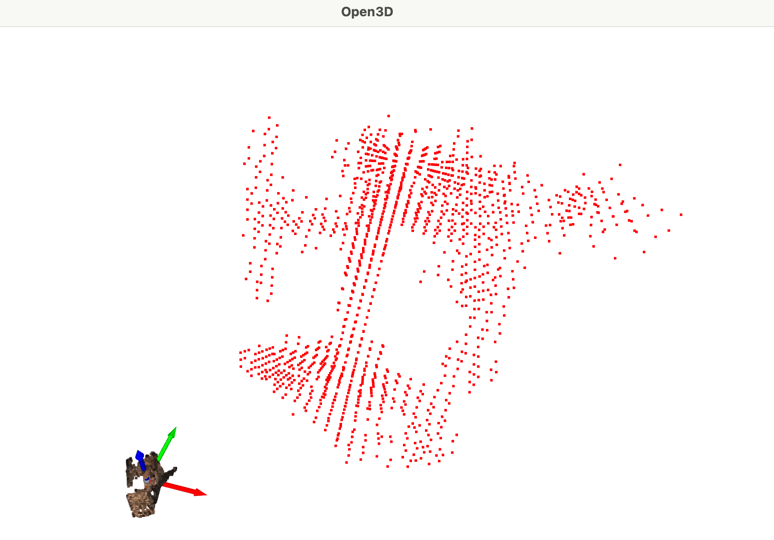

# 3D-VAEGAN for Common Objects in 3D (CO3D)

This repository contains tools and code for working with the CO3D dataset to train 3D-VAEGAN models that can generate 3D shapes from 2D images.

## Files Overview

### `co3d_ply2voxel.py`

This script converts point cloud (PLY) files from the CO3D dataset into binary voxel (binvox) representations that can be used for training 3D-VAEGAN models.

#### Data Structure Assumptions

The script assumes the CO3D dataset is organized in the following structure:

```
input/                            # Data root
└── chair/                        # Category folder
    ├── 58_3353_10266_processed/  # Processed sequence folder
    │   ├── Fsequence_meta.json   #
    │   └── poses/                # Camera poses
    └── 58_3353_10266_dataset_instance/  # Dataset instance folder
        ├── images/               # RGB images
    │   ├── masks/                # Segmentation masks
    │   ├── depths/               # Depth maps
    │   ├── depth_masks/          # Depth validity masks
        ├── pointcloud.ply        # 3D point cloud
        └── 58_3353_10266.binvox  # Binvox file will be generated at HERE!
```

The script expects each sequence to have both a `_processed` and a `_dataset_instance` version, where:
- The `_processed` folder contains poses and meta pose json
- The `_dataset_instance` folder contains the point cloud file (`pointcloud.ply`), RGB images, masks, depths, and poses

#### Usage

```bash
python co3d_ply2voxel.py --dataset_root=/path/to/input --categories chair --voxel_resolution=32 --visualize=true
# example
co3d_ply2voxel.py --dataset_root=/Users/yuyangtian/Documents/NEU/CS5330/3D_VAE_GAN/input --visualize=t 
```

Parameters:
- `--dataset_root`: Path to the root directory containing the dataset (required, must be absolute path)
- `--categories`: Categories to process (default: ['chair'])
- `--voxel_resolution`: Resolution of the voxel grid (default: 32)
- `--visualize`: Whether to visualize a sample of the output (default: False) you can use yes, t, true or 1, the input will be converted to boolean

The script:
1. Scans the dataset structure to find matching sequence pairs
2. Loads point cloud data from the PLY files
3. Converts point clouds to voxel representations at the specified resolution
4. Saves the voxels as binvox files in the same folder as the source point cloud
5. Optionally visualizes a sample of the point cloud and voxel representation

#### Visualization

When `--visualize=true` is specified, the script will display:
- The original point cloud (with original colors)
- The voxelized representation (in red)
- A 3D coordinate frame for reference
- they're not positioned in the same location in 3D space. This is because the voxel coordinates are in grid space (usually starting from [0,0,0]) while the point cloud is in its original world coordinates.
- The size difference is because the voxel representation is displayed in its raw grid space, while the point cloud is in its original world coordinates.
Result image for `58_3353_10266_dataset_instance`



### `main.py`

This is a skeleton file intended to serve as the entry point for training and testing different variants of 3D-VAEGAN models. It includes a comprehensive argument parsing system but currently does not implement the actual training or testing functionality.

#### Model Variants

The skeleton file provides infrastructure for several model variants:
- `3DVAEGAN`: Basic single-view 3D-VAEGAN
- `3DVAEGAN_MULTIVIEW`: 3D-VAEGAN with multiple views
- `3DVAEGAN_POSE`: 3D-VAEGAN with pose information
- `3DVAEGAN_MULTIVIEW_POSE`: 3D-VAEGAN with multiple views and pose information

These functions need to be implemented in separate files and imported into `main.py`.

#### Usage

```bash
python main.py --alg_type=3DVAEGAN_MULTIVIEW --obj=chair --batch_size=32
```

The script provides extensive command-line options for customizing model behavior, directory structure, and training parameters.


## Model Architecture (`model.py`)

The project implements a 3D-VAEGAN architecture with a clean, modular design built on shared base classes:

### Base Classes

- **ModelBase**: Common foundation for all network components
  - Provides utility methods for size calculations and padding
  - Ensures consistent architecture across all components
  - Simplifies addition of new model variants

- **EncoderBase**: Shared encoder implementation
  - Defines the core image processing pipeline
  - Provides the reparameterization mechanism for all encoders
  - Allows for consistent processing across single and multi-view scenarios

### Generator (Previous `_G`, now `Generator`)
- **Input**: Latent vector z (size determined by `args.z_size`, typically 200)
- **Output**: 3D voxel grid representing an object (shape: [batch_size, 1, 64, 64, 64])
- **Architecture**: 
  - 5 transposed convolutional layers implemented as a ModuleList
  - Consistent pattern: ConvTranspose3d → BatchNorm3d → ReLU (Sigmoid for final layer)
  - Progressive upsampling: 1³ → 4³ → 8³ → 16³ → 32³ → 64³
  - Corresponding channel reduction: z_size → cube_len*8 → cube_len*4 → cube_len*2 → cube_len → 1

### Discriminator (Previous `_D`, now `Discriminator`)
- **Input**: 3D voxel grid (shape: [batch_size, 1, cube_len, cube_len, cube_len])
- **Output**: Binary classification (shape: [batch_size, 1, 1, 1, 1])
- **Architecture**:
  - 5 convolutional layers implemented as a ModuleList
  - Consistent pattern: Conv3d → BatchNorm3d → LeakyReLU (Sigmoid for final layer)
  - Progressive downsampling: cube_len³ → 32³ → 16³ → 8³ → 4³ → 1³
  - Corresponding channel expansion: 1 → cube_len → cube_len*2 → cube_len*4 → cube_len*8 → 1

### Encoder Implementations

#### SingleViewEncoder (Previous `_E`)
- **Input**: 2D RGB image (shape: [batch_size, 3, image_size, image_size])
- **Output**: Distribution parameters µ and log(σ²) in latent space
- **Architecture**:
  - Inherits from EncoderBase
  - 5 convolutional layers for feature extraction
  - Two parallel fully connected layers for mean and log-variance
  - Reparameterization trick implementation for sampling

#### MultiViewEncoder (Previous `_E_MultiView`)
- **Input**: List of 2D images from different viewpoints
- **Output**: Combined latent representation plus per-view parameters
- **Architecture**:
  - Extends SingleViewEncoder functionality
  - Processes each view independently through shared encoder
  - Combines view information through configurable strategies:
    - Mean: Average all view encodings (default)
    - Max: Element-wise maximum across views
    - Concat: Concatenate all views (extensible but not implemented)

The encoder outputs mean (μ) and log variance (log σ²) parameters that define a distribution in latent space. The reparameterization trick is used to sample from this distribution while maintaining differentiability.

## Dataset Implementation (`utils.py`)

### CO3DDataset

The `CO3DDataset` class provides a unified interface for working with the Common Objects in 3D (CO3D) dataset:

- **Flexible configuration**:
  - Single-view or multi-view mode
  - With or without camera pose information
  - Option to apply foreground masks to images

- **Expected directory structure**:
  ```
  input/
  └── category/                       # Category folder (e.g., "chair")
      ├── sequence_name_processed/    # Processed data
      │   ├── sequence_meta.json      # Metadata file with frame info
      │   └── poses/                  # Camera poses folder
      └── sequence_name_dataset_instance/  # Dataset instance folder
          ├── images/                 # RGB images
          ├── masks/                  # Segmentation masks
          ├── depths/                 # Depth maps
          ├── depth_masks/            # Depth validity masks
          ├── pointcloud.ply          # 3D point cloud
          └── sequence_name.binvox    # Binvox voxel representation
  ```

- **Features**:
  - Automatic sequence discovery and validation
  - Intelligent frame sampling for multi-view mode
  - Image preprocessing with masks to focus on foreground objects
  - Unified interface for different training configurations

- **Return formats**:
  - Single-view: `(image_tensor, volume_tensor)` or `(image_tensor, pose, volume_tensor)`
  - Multi-view: `(image_tensors_list, volume_tensor)` or `(image_tensors_list, poses_list, volume_tensor)`

The dataset implementation handles the complexity of the CO3D data structure and provides a clean interface for the 3D-VAEGAN training pipeline.

## Usage Notes

1. **Dataset Preparation**:
   - Convert point clouds to voxel grids using the `co3d_ply2voxel.py` script
   - Ensure the directory structure matches the expected format

2. **Data Configuration**:
   - Set the appropriate category with `--obj` (default: "chair")
   - Configure the number of views with `--num_views` (default: 12, used in multi-view mode)
   - Set the image size with `--image_size` (default: 224)
   - Set the voxel resolution with `--cube_len` (default: 32)

3. **Training Configuration**:
   - Choose the algorithm type with `--alg_type` (single-view: '3DVAEGAN', multi-view: '3DVAEGAN_MULTIVIEW')
   - Configure multi-view combination type with `--combine_type` (options: 'mean', 'max')
   - Set the latent space size with `--z_size` (default: 200)

# 3D-VAE-GAN Training Guide

This repository implements a 3D Variational Autoencoder Generative Adversarial Network (3D-VAE-GAN) for generating 3D shapes from 2D images. The model can be trained in several configurations: single-view, multi-view, and with/without pose information.

## Requirements

- Python 3.x
- PyTorch
- NumPy
- Matplotlib
- PyYAML
- (Optional) TensorFlow for TensorBoard logging

## Project Structure

```
├── config/
│   ├── default.yaml
│   ├── single_view.yaml
│   ├── multi_view.yaml
│   └── multi_view_with_pose.yaml
├── src/
│   ├── main.py
│   ├── train.py
│   ├── model.py
│   ├── utils.py
│   └── lr_sh.py
├── input/
│   └── chair/  # Dataset directory
├── output/
│   ├── image/  # Output visualizations
│   ├── pickle/ # Model checkpoints
│   └── log/    # Training logs
```

## Data Preparation

Place your dataset in the `input/` directory. The default configuration expects a dataset of chairs, but this can be configured. The dataset should be organized according to the requirements of the `CO3DDataset` class.

### Training Modes

The model supports four training modes:

1. **Single-View (3DVAEGAN)**: Train using single images per object
2. **Multi-View (3DVAEGAN_MULTIVIEW)**: Train using multiple views of each object
3. **Single-View with Pose (3DVAEGAN_POSE)**: Incorporate pose information with single views
4. **Multi-View with Pose (3DVAEGAN_MULTIVIEW_POSE)**: Incorporate pose information with multiple views

## Training the Model

## Configuration Files

Configuration files are stored in the `config/` directory. Several example configurations are provided:

- `config/default.yaml`: Default configuration used when no config file is specified
- `config/single_view.yaml`: Configuration for single-view 3D-VAEGAN
- `config/multi_view.yaml`: Configuration for multi-view 3D-VAEGAN
- `config/multi_view_with_pose.yaml`: Configuration for multi-view 3D-VAEGAN with pose information

## Using Configuration Files

You can use a configuration file by specifying the `--config` parameter:

```bash
python main.py --config config/multi_view.yaml
```

You can also override specific parameters from the command line:

```bash
python main.py --config config/multi_view.yaml --batch_size 64 --obj table
```

If no configuration file is specified, the system will try to use `config/default.yaml`.

## Configuration Parameters

All parameters available in the configuration files. Some key parameters include:

### Model Parameters
- `alg_type`: Algorithm type (`3DVAEGAN`, `3DVAEGAN_MULTIVIEW`, etc.)
- `batch_size`: Number of samples per batch
- `z_size`: Latent space dimension
- `cube_len`: Voxel grid resolution

### Multi-view Parameters
- `num_views`: Number of views per object
- `combine_type`: Method for combining views (`mean`, `max`)

### Environment-Specific Configurations

You can use different configurations for different environments:

```yaml
# config/dev.yaml
output_dir: "../output_dev"
batch_size: 8
n_epochs: 5

# config/prod.yaml
output_dir: "/data/output"
batch_size: 32
n_epochs: 1000
```

## Monitoring Training

During training, the following metrics are printed after each epoch:

- `D_loss`: Total discriminator loss (comprised of real and fake components)
 - `D_R`: Loss on real samples
 - `D_F`: Loss on fake samples
- `G_loss`: Total generator loss
 - `Recon`: Reconstruction loss for the generator path
- `E_loss`: Total encoder loss
 - `Recon`: Reconstruction loss for the encoder path
 - `KL`: KL divergence loss for the VAE component
- `D_acc`: Discriminator accuracy (percentage of samples correctly classified)

The model periodically saves:

1. Voxel visualizations in the `output/image/` directory
2. Model checkpoints in the `output/pickle/` directory
3. Model metrics logging in the `output/log/` directory
You can then view the training progress with:
```bash
# When you run TensorBoard, remember to point it at the log directory (not the specific event file):
tensorboard --logdir=../output/log/model=Singleview_cube=32_bs=10_g_lr=0.0025_d_lr=0.001_z=norm_bias=False_sl=True
```

## Troubleshooting Common Issues

### Empty Voxel Visualizations

If your voxel visualizations appear empty during early training:

1. **Lower the visualization threshold**: Edit the `SavePloat_Voxels` function in `utils.py` to use a threshold lower than 0.5.

2. **Check training stability**: High reconstruction losses (> 100,000) may indicate training instability. Try:
   - Reducing learning rates
   - Adding gradient clipping
   - Using a smaller batch size
   - Enabling bias terms (`bias: true` in config)

### CUDA Out of Memory

If you encounter memory issues:
- Reduce batch size
- Reduce model complexity (smaller cube_len)
- Use a smaller number of views in multi-view mode


## Advanced Optimization Tips

For optimal training results:

1. **Learning Rate Schedule**: The model uses MultiStepLR with milestones at 500 and 1000 epochs. Adjust these based on your dataset.

2. **KL Weight Annealing**: Consider implementing KL weight annealing by modifying the loss calculation in `train.py`.

3. **Discriminator Throttling**: The discriminator is only updated when its accuracy falls below `d_thresh` (default 0.8). Lower this value if the generator struggles to learn.


## Citation
```
@inproceedings{3dvaegan,
  title={Learning a Probabilistic Latent Space of Object Shapes via 3D Generative-Adversarial Modeling},
  author={Wu, Jiajun and Zhang, Chengkai and Xue, Tianfan and Freeman, Bill and Tenenbaum, Josh},
  booktitle={Advances in Neural Information Processing Systems},
  year={2016}
}
```
## Notes

- The binvox format stores only binary occupancy information (whether a voxel is filled or not) and does not include color information.
- The voxelization process includes a padding factor (default 0.05) to prevent clipping at the edges of the point cloud.
- Point cloud visualization uses the original colors from the PLY file if available.